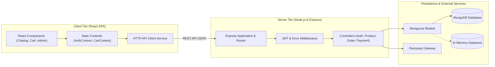

# Mamta Pickles Fullstack E-Commerce Platform

A production-grade, full-stack e-commerce web application engineered for artisanal food commerce. Built with a modern micro-monorepo structure using React, Vite, Node.js, Express, MongoDB, and integrated with Razorpay payment processing.

---

## Live Demo

[](https://mamta-pickles-fullstack-c3sk3w76e.vercel.app)

[](https://reactjs.org)
[](https://vitejs.dev)
[](https://nodejs.org)
[](https://expressjs.com)
[](https://www.mongodb.com)
[](https://razorpay.com)
[](https://vercel.com)

---

## Technical Overview & Engineering Metrics

- Architecture: Decoupled client-server monorepo with centralized state management.
- Backend Performance: Sub-second API response times with automated payload validation and error boundary handling.
- Resilience: Dual-layer persistence featuring automated fallback to an in-memory datastore when MongoDB services are unavailable.
- Security: Role-Based Access Control (RBAC), bcrypt password hashing (10 salt rounds), and JWT Bearer token authentication.
- Payment Processing: Webhook-ready Razorpay integration utilizing HMAC-SHA256 signature verification.
- Frontend Build: Modern Vite bundle optimization achieving sub-250ms production build times and modular code splitting.

---

## System Architecture

### Component Data Flow Diagram



### Directory Structure

```text
mamta-pickles-fullstack/
├── backend/                      # Express REST API Server
│   ├── src/
│   │   ├── config/               # Database & Environment configuration
│   │   │   ├── db.js
│   │   │   └── env.js
│   │   ├── controllers/          # Business logic handlers
│   │   │   ├── authController.js
│   │   │   ├── productController.js
│   │   │   ├── orderController.js
│   │   │   └── paymentController.js
│   │   ├── middleware/           # Authentication & Error handling
│   │   │   ├── authMiddleware.js
│   │   │   └── errorMiddleware.js
│   │   ├── models/               # Mongoose Schemas & Data Models
│   │   │   ├── userModel.js
│   │   │   ├── productModel.js
│   │   │   └── orderModel.js
│   │   ├── routes/               # REST Route Definitions
│   │   │   ├── authRoutes.js
│   │   │   ├── productRoutes.js
│   │   │   ├── orderRoutes.js
│   │   │   └── paymentRoutes.js
│   │   ├── utils/                # Token utility & Seed scripts
│   │   │   ├── generateToken.js
│   │   │   ├── seedData.js
│   │   │   └── seeder.js
│   │   └── app.js                # Express app initialization
│   ├── .env.example
│   ├── package.json
│   ├── server.js                 # HTTP Server Entry Point
│   └── README.md
├── frontend/                     # React Single Page Application (SPA)
│   ├── src/
│   │   ├── components/           # UI Components
│   │   │   ├── auth/             # Authentication Modals
│   │   │   ├── common/           # Toast & Info Modals
│   │   │   ├── layout/           # Navbar & Footer
│   │   │   └── store/            # Catalog, Cart Drawer, Checkout & Admin Dashboard
│   │   ├── context/              # React Context Providers (Auth & Cart)
│   │   │   ├── AuthContext.jsx
│   │   │   └── CartContext.jsx
│   │   ├── services/             # API HTTP Client Service
│   │   │   └── api.js
│   │   ├── styles/               # CSS Variables & Theme Styles
│   │   │   └── index.css
│   │   ├── App.jsx               # Application Shell
│   │   └── main.jsx              # React Mounting Point
│   ├── index.html
│   ├── vite.config.js
│   ├── package.json
│   └── README.md
├── package.json                  # Workspace Monorepo Manager
└── README.md
```

---

## Feature Specifications

### 1. Product Catalog & Dynamic Weight Selection
- Category-based filtering (Mango, Chili, Lemon, Garlic, Mixed, Specialty).
- Full-text instant search across product titles, descriptions, and ingredients.
- Dynamic jar weight options (250g, 500g, 1kg) with real-time price re-calculation.

### 2. Shopping Cart & Free Shipping Calculation
- Persistent shopping cart backed by browser `localStorage`.
- Real-time free shipping threshold calculator (free delivery on orders above INR 599).
- Dynamic tax (5% GST) and delivery fee computations.

### 3. Authentication & Security
- User registration and login utilizing JWT tokens.
- Role-based authorization distinguishing regular customers from system administrators.
- Password hashing via `bcryptjs`.

### 4. Checkout & Payment Processing
- Multi-channel payment support: Razorpay Online Payment Gateway and Cash on Delivery (COD).
- Backend HMAC-SHA256 signature verification for online transactions.
- Mandatory user authentication prior to checkout submission.

### 5. Store Administration Dashboard
- Real-time sales metrics: Total Store Revenue, Total Orders Count, Pending Orders, and Delivered Orders.
- Administrative order management panel allowing status updates (Pending, Processing, Shipped, Delivered, Cancelled) and payment verification.

---

## REST API Specification

### Authentication Routes (`/api/auth`)
| Method | Endpoint | Access | Description |
| :--- | :--- | :--- | :--- |
| `POST` | `/api/auth/register` | Public | Register a new user account |
| `POST` | `/api/auth/login` | Public | Authenticate user and issue JWT token |
| `GET` | `/api/auth/profile` | Private | Retrieve current user profile |

### Product Routes (`/api/products`)
| Method | Endpoint | Access | Description |
| :--- | :--- | :--- | :--- |
| `GET` | `/api/products` | Public | Query products with optional search, category, and sort parameters |
| `GET` | `/api/products/:id` | Public | Retrieve detailed product specs by ID or slug |
| `POST` | `/api/products/seed` | Public | Seed initial catalog dataset |

### Order Routes (`/api/orders`)
| Method | Endpoint | Access | Description |
| :--- | :--- | :--- | :--- |
| `POST` | `/api/orders` | Private | Submit new customer order |
| `GET` | `/api/orders/my-orders` | Private | Fetch logged-in user order history |
| `GET` | `/api/orders/:id` | Private | Retrieve specific order by ID |
| `GET` | `/api/orders` | Admin | Retrieve all customer orders |
| `PUT` | `/api/orders/:id/status` | Admin | Update fulfillment and payment status |
| `PUT` | `/api/orders/:id/pay` | Private | Update order payment verification |

### Payment Routes (`/api/payments`)
| Method | Endpoint | Access | Description |
| :--- | :--- | :--- | :--- |
| `POST` | `/api/payments/create-order` | Public | Generate Razorpay order payload |
| `POST` | `/api/payments/verify` | Public | Verify Razorpay payment signature |

---

## Test Credentials

### Store Administrator Account
- Email: `admin@mamtapickles.com`
- Password: `adminpassword123`
- Role: `admin`

### Customer Account
- Email: `demo@mamtapickles.com`
- Password: `password123`
- Role: `user`

---

## Local Development Setup

### Prerequisites
- Node.js (v18.0.0 or higher)
- npm (v9.0.0 or higher)
- MongoDB (Optional, in-memory fallback active by default)

### Step 1: Install Dependencies
Install dependencies for both backend and frontend workspaces:
```bash
npm run install:all
```

### Step 2: Configure Environment Variables
Create a `.env` file inside the `backend` directory using the provided template:
```bash
cp backend/.env.example backend/.env
```

Default Configuration:
```env
PORT=5000
MONGO_URI=mongodb://127.0.0.1:27017/mamta_pickles
JWT_SECRET=mamta_pickles_secret_key_2026
JWT_EXPIRES_IN=30d
RAZORPAY_KEY_ID=rzp_test_mamta_pickles_key
RAZORPAY_KEY_SECRET=rzp_test_mamta_pickles_secret
```

### Step 3: Run Fullstack Application
Execute the development command to launch both services concurrently:
```bash
npm run dev
```

- Frontend Web Application: http://localhost:3000
- Backend REST API: http://localhost:5000/api

---

## Production Build & Deployment

To verify and build the client application for production:
```bash
cd frontend
npm run build
```

Production output will be compiled into `frontend/dist`.
